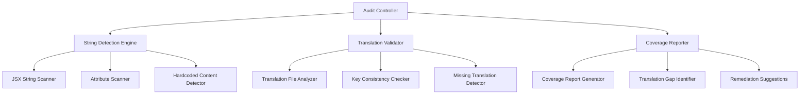

# Complete Internationalization Audit - Design Document

## Overview

This design outlines a comprehensive approach to audit and ensure complete internationalization (i18n) coverage across the Navratri app for all 8 supported languages. The solution involves automated detection of hardcoded strings, systematic translation file validation, and implementation of missing translations to achieve 100% i18n coverage.

The current app has a solid i18n foundation using react-i18next with 8 languages (English, Hindi, Tamil, Marathi, Telugu, Malayalam, Bengali, Kannada) and 4 translation namespaces (common, pages, recipes, festival). However, analysis reveals several areas with hardcoded strings that need translation.

## Architecture

### Current I18n Infrastructure
- **Framework**: react-i18next with i18next-browser-languagedetector
- **Languages**: 8 supported languages with proper language detection
- **Structure**: Organized into 4 namespaces (common, pages, recipes, festival)
- **Context**: LanguageProvider with useLanguage hook for consistent access

### Audit System Components



## Components and Interfaces

### 1. String Detection Engine

**Purpose**: Systematically identify all hardcoded strings in the codebase

**Components**:
- **JSX Content Scanner**: Detects hardcoded text in JSX elements
- **Attribute Scanner**: Finds untranslated alt text, aria-labels, placeholders
- **Template Literal Detector**: Identifies dynamic strings that need translation
- **Toast/Alert Scanner**: Locates hardcoded notification messages

**Interface**:
```typescript
interface HardcodedString {
  file: string;
  line: number;
  column: number;
  content: string;
  context: 'jsx-content' | 'attribute' | 'template-literal' | 'toast';
  suggestedKey?: string;
  priority: 'high' | 'medium' | 'low';
}

interface StringDetectionResult {
  hardcodedStrings: HardcodedString[];
  totalFiles: number;
  affectedFiles: string[];
  summary: {
    byContext: Record<string, number>;
    byPriority: Record<string, number>;
  };
}
```

### 2. Translation File Validator

**Purpose**: Ensure consistency and completeness across all translation files

**Components**:
- **Structure Validator**: Verifies all language files have identical key structures
- **Missing Key Detector**: Identifies keys present in some languages but missing in others
- **Content Quality Checker**: Validates translation content quality and completeness
- **Namespace Consistency Checker**: Ensures proper namespace organization

**Interface**:
```typescript
interface TranslationValidationResult {
  missingKeys: {
    language: string;
    namespace: string;
    keys: string[];
  }[];
  structuralInconsistencies: {
    expectedStructure: Record<string, any>;
    actualStructure: Record<string, Record<string, any>>;
  };
  qualityIssues: {
    language: string;
    key: string;
    issue: 'empty' | 'placeholder' | 'untranslated' | 'malformed';
  }[];
}
```

### 3. Coverage Analysis System

**Purpose**: Provide comprehensive reporting on i18n coverage and gaps

**Components**:
- **Page Coverage Analyzer**: Tracks translation coverage per page/component
- **Feature Coverage Tracker**: Monitors i18n coverage for specific features
- **Accessibility Coverage Checker**: Ensures all accessibility strings are translated
- **Dynamic Content Analyzer**: Identifies content that needs runtime translation

### 4. Automated Remediation Tools

**Purpose**: Provide tools and suggestions for fixing identified issues

**Components**:
- **Translation Key Generator**: Suggests appropriate keys for hardcoded strings
- **Batch Translation Updater**: Tools for updating multiple translation files
- **Code Transformation Helper**: Assists in replacing hardcoded strings with translation calls
- **Template Generator**: Creates translation templates for missing content

## Data Models

### Translation Audit Report
```typescript
interface TranslationAuditReport {
  timestamp: string;
  overallCoverage: number; // percentage
  languageCoverage: Record<string, number>;
  hardcodedStrings: HardcodedString[];
  missingTranslations: MissingTranslation[];
  recommendations: Recommendation[];
  criticalIssues: CriticalIssue[];
}

interface MissingTranslation {
  key: string;
  namespace: string;
  missingInLanguages: string[];
  suggestedTranslations?: Record<string, string>;
  context: string;
  priority: 'critical' | 'high' | 'medium' | 'low';
}

interface Recommendation {
  type: 'add-translation' | 'fix-hardcoded' | 'improve-structure' | 'accessibility';
  description: string;
  files: string[];
  estimatedEffort: 'low' | 'medium' | 'high';
  autoFixable: boolean;
}
```

### Translation Content Structure
```typescript
interface TranslationContent {
  // Static page content
  pages: {
    [pageKey: string]: {
      title: string;
      description: string;
      content?: Record<string, any>;
    };
  };
  
  // Interactive elements
  common: {
    navigation: Record<string, string>;
    actions: Record<string, string>;
    labels: Record<string, string>;
    messages: Record<string, string>;
    accessibility: Record<string, string>;
  };
  
  // Feature-specific content
  recipes: Record<string, any>;
  festival: Record<string, any>;
}
```

## Error Handling

### Translation Loading Errors
- **Fallback Strategy**: Use English as fallback for missing translations
- **Error Reporting**: Log missing translation keys for monitoring
- **Graceful Degradation**: Display key names when translations fail to load
- **User Notification**: Inform users when translations are partially unavailable

### Validation Errors
- **Schema Validation**: Ensure translation files follow expected structure
- **Content Validation**: Check for empty or malformed translations
- **Consistency Checks**: Verify parameter consistency across languages
- **Format Validation**: Ensure proper JSON structure and encoding

### Runtime Error Handling
```typescript
interface TranslationErrorHandler {
  handleMissingKey(key: string, namespace: string, language: string): string;
  handleLoadingError(language: string, namespace: string): void;
  handleValidationError(errors: ValidationError[]): void;
  reportUsageMetrics(key: string, language: string): void;
}
```

## Testing Strategy

### Automated Testing Approach

1. **Translation Coverage Tests**
   - Verify all hardcoded strings are identified
   - Ensure all translation keys exist across languages
   - Validate translation file structure consistency

2. **Component Translation Tests**
   - Test each component renders correctly in all languages
   - Verify language switching updates all content
   - Check accessibility attributes are translated

3. **Integration Tests**
   - Test complete user flows in different languages
   - Verify navigation and interactions work across languages
   - Test error scenarios with translated messages

4. **Performance Tests**
   - Measure translation loading times
   - Test memory usage with all languages loaded
   - Verify lazy loading of translation namespaces

### Manual Testing Checklist

1. **Visual Verification**
   - Review each page in all 8 languages
   - Check text overflow and layout issues
   - Verify cultural appropriateness of translations

2. **Accessibility Testing**
   - Test screen reader compatibility in each language
   - Verify keyboard navigation with translated labels
   - Check color contrast with different text lengths

3. **User Experience Testing**
   - Test language switching responsiveness
   - Verify content makes sense in cultural context
   - Check for missing or inappropriate translations

### Validation Scripts

```typescript
interface ValidationScript {
  name: string;
  description: string;
  execute(): Promise<ValidationResult>;
}

// Example validation scripts:
// - detectHardcodedStrings()
// - validateTranslationCompleteness()
// - checkAccessibilityTranslations()
// - verifyNamespaceConsistency()
```

## Implementation Phases

### Phase 1: Audit and Detection
- Implement string detection engine
- Run comprehensive codebase scan
- Generate initial audit report
- Prioritize identified issues

### Phase 2: Translation File Enhancement
- Validate existing translation files
- Identify and fill missing translations
- Ensure structural consistency
- Add missing accessibility translations

### Phase 3: Code Remediation
- Replace identified hardcoded strings
- Update components to use translation system
- Add proper fallback handling
- Implement error reporting

### Phase 4: Validation and Testing
- Run comprehensive test suite
- Perform manual verification
- Test accessibility compliance
- Validate performance impact

### Phase 5: Monitoring and Maintenance
- Implement ongoing monitoring
- Create developer guidelines
- Set up automated validation
- Establish translation update process